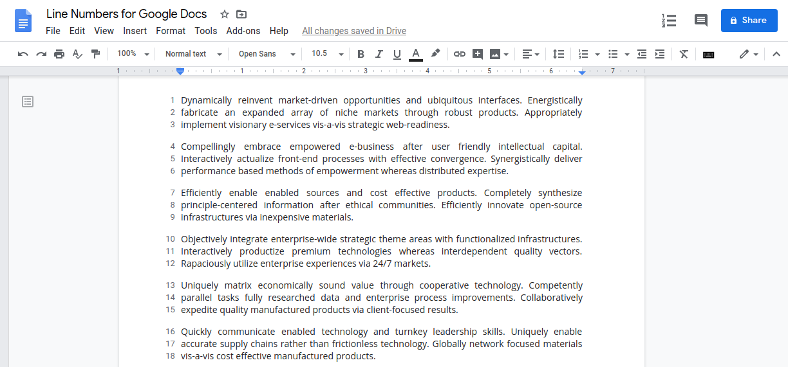

## Line Numbers for Google Docs

> A seamless way to numbers the lines of your Google Documents!

## What is it

Line Numbers for Google Docs is a chrome extension that lets you number your Google Documents.

## Features

- Custom numbering settings for each of your documents.
- Print your document with custom line numbering.
- Export your document with line numbers to a PDF or Word document.
- Support for multi-column line numbering.
- Restart numbering on every new page.
- Automatically adapts the numbering position based on the writing direction.
- Format line numbers by changing their size, font, and color.
- Add custom dividers between the line numbers and text.

## Examples

This is what it looks like.

## Looking to get started

Head over to the [quick start](quickstart.md) section for a quick guide on how to start using the extension.