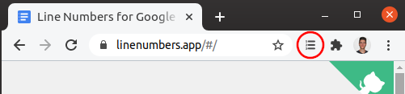

# Premium

Getting a premium subscription helps us cover the development and running costs of the extension.

If you enjoy the extension or find it useful please consider getting a premium subscription. It would be greatly appreciated!

#### What do you get?

- Premium line numbering settings which include:
    - Numbering columns
    - Choosing the size of the numbers
    - Choosing the color of the numbers
    - Adding single or double lined document borders

#### How to get it?

1. Open the **extension popup menu** found in the top right corner of your Chrome toolbar (circled in red below).

> 

2. **Sign in** if you haven't already.

> 

3. In the same popup menu, click on **Go Premium**.

> 

4. Select how much you want to pay per year and click on **Support**.

> 

5. A new tab should open that will redirect you to a secure Stripe® checkout page to complete your purchase.

> 
