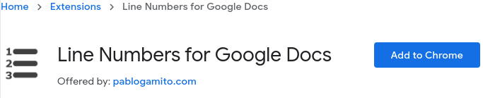
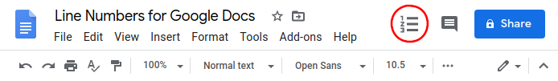
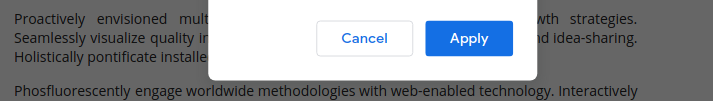

# Quick start

#### 1. Add the extension to Google Chrome (skip if already installed)

Head over to the **[chrome web store page](https://chrome.google.com/webstore/detail/line-numbers-for-google-d/mblodabbcapnkgcfnddfpfaamjckjlik)** of the extension and click on the **Add to Chrome** button.

> 

Wait for the extension to finish installing before proceeding.

#### 2. Open your favorite or refresh Google Docs file

Head over to **[Google Docs](https://docs.google.com/)** and open any of your documents or create a new document. If you already have a document open make sure to refresh it for the extension to take effect.

#### 3. Open the line numbering settings

In the **top right** corner of your document you should see a **new icon** injected by the extension — click on it to open up the line numbering settings.

> 

If you do not see this icon, please try restarting Chrome and reloading the Google Docs page.

If your are still experiencing problems with this, please **[contact me ](contact.md)** so that I can fix this problem for you.

#### 4. Enable line numbering

Check the **Show line numbering** checkbox to enable line numbering in your document.

> 

#### 5. Tweak the settings and apply

Tweak all the available settings to your liking and remember to click **Apply** to save your changes.

> 

Your settings will be synchronized across your devices if you are logged in to the same Google account in all your Chrome browser.

--------------------------------------------------------------------------------

## Not working?

If anything is not working please check out the **[FAQ](faq.md)** or **[contact me](contact.md)** so that I can try and fix it.