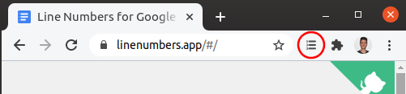

# Line Numbers for Google Docs <small>2.1.0</small>

### You have updated to version 2.1.0 of the extension!

#### What are the major changes?

- Ability to sign in with your Google account allowing for synchronization of your line numbering settings with:
    - other users you may have shared the document with and who also have the extension installed. 
    - and across any of your devices where the extension is installed and you are logged in on.
- Premium subscription which includes features such as line numbering styling and document borders.

#### Sign in now!

To benefit from these new features sign in with your Google account.

To do this click on the extension icon (circled in red below) in the Chrome toolbar.

> 

Once you have clicked on the extension icon in the Chrome toolbar you should see the following:

> 

Click on the *Sign in with Google* button and it should open up a new windows for you to sign in.

Once signed in all your settings will be synched to the cloud so that you may access them on any device and so that anyone you have shared your documents with also have access to the numbering settings on your document.

#### Have Questions?

Reach out [here](contact.md) if you have any questions.

